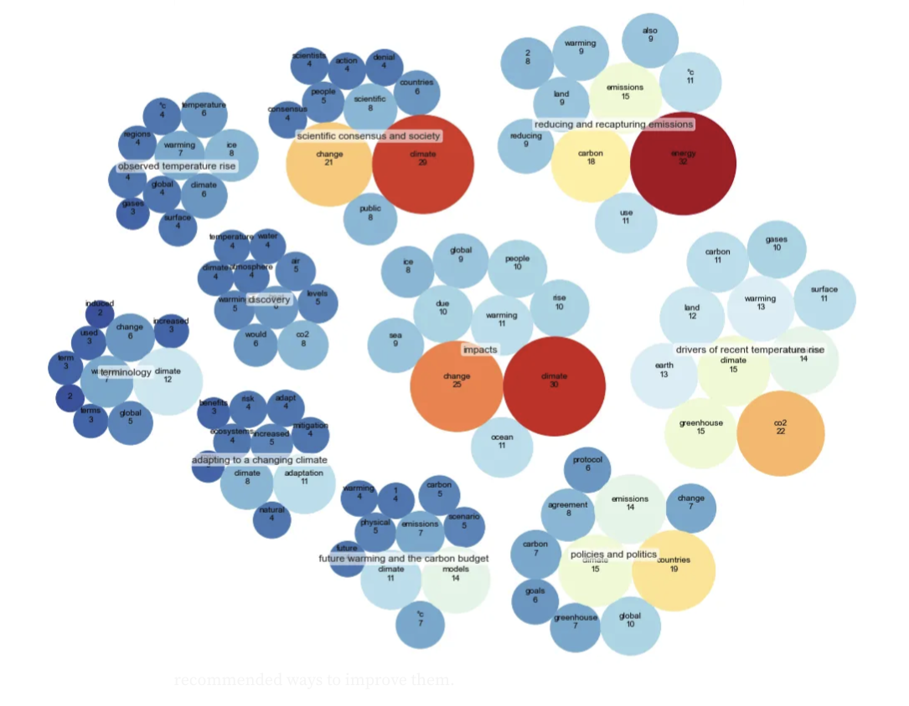
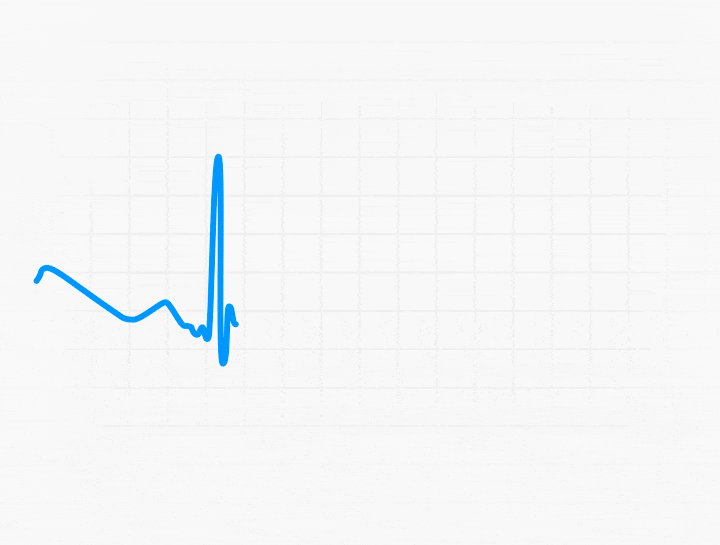
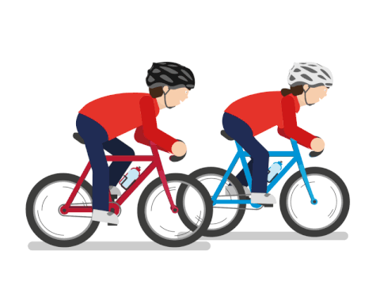
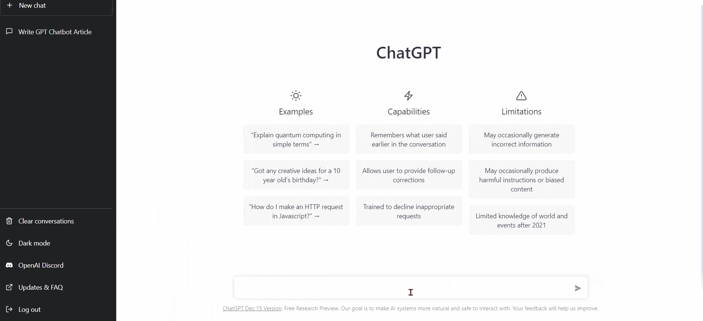
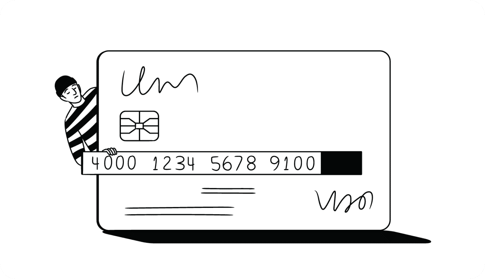
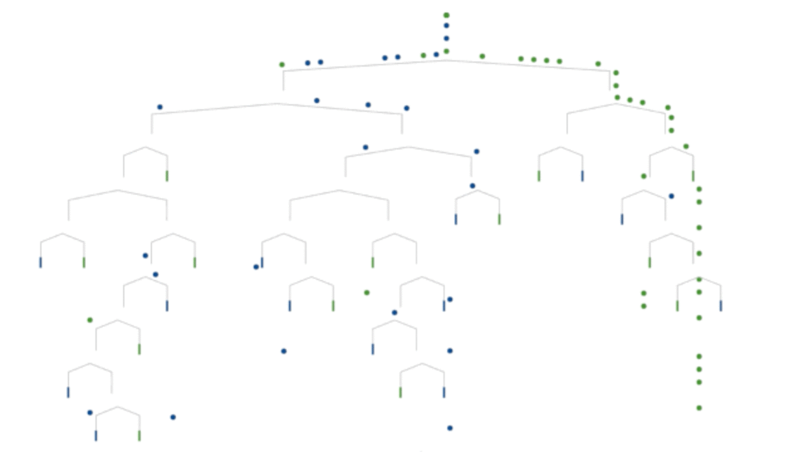

# Hey there! 👋 Welcome to my GitHub profile.

   I'm Soumya, a Ph.D. in Systems and Control, currently working as a Senior Data Scientist. 
   I'm passionate about Mathematics, Statistics, and Machine Learning and enjoy tackling real-life projects to enhance my practical skills and explore new theoretical concepts in statistics. I'm always open to new employment opportunities and project collaborations, so feel free to reach out to me at soumya_02@outlook.com. 📧
   - Access my resume here: [📋](SOUMYA_DASGUPTA_Resume.pdf)
   - You can connect with me on [LinkedIn](https://www.linkedin.com/in/soumya-profile/) and also find me actively participating on [LeetCode](https://leetcode.com/themanutdmaniac/). 🖊️

# About Me

I thrive on using my expertise to provide data-driven solutions across various domains. As a Data Scientist with a PhD degree in Systems and Control and an extensive portfolio of over multiple projects, I'm well-equipped to tackle a wide range of challenges. My ultimate goal is to make a meaningful impact through data analysis and machine learning techniques. 💼📊🚀

# Skills

I possess a diverse set of skills that allow me to excel in the field of Data Science and Machine Learning. Here are some of the key skills I bring to the table:

- Machine Learning and Data Science 🤖📈
- Programming: Python 🐍💻
- Exploratory Data Analysis and Data Visualization 📊📈
- Statistics Analysis and Modelling 📉🔬
- Bayesian Inference 📊📊
- Time Series Analysis ⏰📊
- Problem Solving 🧩💡
- Data Pre-processing and Feature Engineering 🛠️📋
- Data Visualization📊

# GitHub Repositories

I love working on projects that challenge me and allow me to learn and grow. Here's few of my highlighted projects:

## 1. [Recommender System](https://github.com/soumyadg/recommender-system)
   - Developed a movie recommendation system using Roberta to provide personalized movie suggestions to users.
   - Implemented in Python 🎬📚🐍
     

## 2. [Cardiovascular Disease Analysis](https://github.com/soumyadg/CardioVascular-Diseases-Analysis)
   - Analyzed cardiovascular disease data to uncover insights into risk factors and patterns using data visualization and statistical analysis.
   - Explored trends and correlations to gain a better understanding of disease prevalence. 💓🔍📊
     

## 3. [Bike Sharing](https://github.com/soumyadg/Bike-Sharing-System)
   - Predicted bike demand in bike-sharing schemes using time series analysis and regression models. 🚲📈🔮
     

## 4. [Food Delivery](https://github.com/soumyadg/food-prep-model)
   - Developed a model to optimize food delivery routes and delivery times, improving efficiency and customer satisfaction.
   - Utilized machine learning algorithms to predict delivery demand based on historical data. 🍔🚚📊
     
   

## 5. [LLMs](https://github.com/soumyadg/LLMs)
   - Worked on Large Language Models (LLMs) for real-time applications and in-context learning to enhance the accuracy and efficiency of machine learning models.
   - Focused on developing LLMs to handle large-scale enterprise data securely. 🔍💻🔒
     

## 6. [Credit Card Fraud Detection](https://github.com/soumyadg/Credit-Card-Fraud-Detection)
   - Built a machine learning model using Python to detect credit card fraud.
   - Employed various classification techniques to achieve high accuracy in identifying fraudulent transactions. 💳🛡️📊
     

## 7. [Travel Advisor using OpenAI and LangChain](https://github.com/soumyadg/traveladvisor)
   - Created a travel advisory system using OpenAI to recommend personalized travel plans to users, available at www.tripadviserai.com 🗺️✈️🌍
     

  ▷▶︎▷▶︎▷▶︎▷▶︎▷▶︎▷▶︎▷▶︎▷▶︎▷▶︎▷▶︎▷▶︎▷▶︎▷▶︎▷▶︎▷▶︎▷▶︎▷▶︎▷▶︎▷▶︎▷▶︎▷▶︎▷▶︎▷▶︎▷▶︎▷▶︎▷▶︎▷▶︎▷▶︎▷▶︎▷▶︎▷▶︎▷▶︎▷▶︎▷▶︎▷▶︎▷▶︎▷▶︎▷▶︎

## Currently working on MLOps on Azure, focusing on Azure OpenAI and Azure Cognitive Search

Feel free to explore the project repositories for more details and code samples!

# Contact
   - 🤝👥 If you have any questions, collaboration ideas, or employment opportunities, don't hesitate to reach out to me via email: soumya_02@outlook.com. 📧

Thank you for visiting my GitHub profile, lets keep growing!  😊🎉

